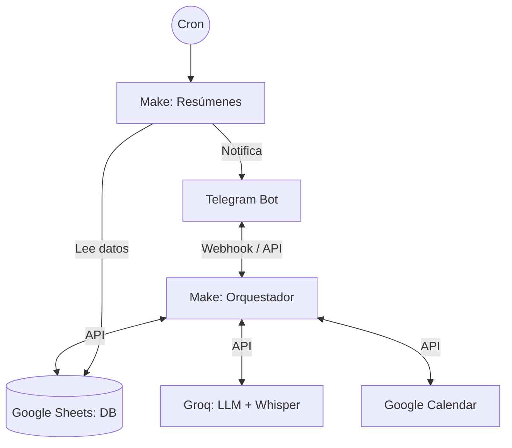

# Gestor Personal de Pendientes (Bot de Telegram)

## Objetivo
Un bot personal en Telegram para gestionar tareas diarias de forma conversacional (texto y voz), superando las limitaciones de los recordatorios estáticos. El bot interpreta lenguaje natural, extrae información estructurada y orquesta el flujo entre una base de datos histórica y una agenda.

## Arquitectura de Alto Nivel

## Componentes
- **Interfaz:** Telegram (texto, voz y botones inline).
- **Orquestador:** Make (versión Free, máximo 2 escenarios).
- **Inteligencia:** Groq (transcripción rápida y estructuración de JSON).
- **Base de Datos:** Google Sheets (fuente de verdad, historial completo).
- **Agenda:** Google Calendar (proyección puntual para alertas nativas).

## Alcance del MVP
- Validación estricta para un único usuario (`authorized_chat_id`).
- Notas de voz hasta 60 segundos.
- Soporte para CRUD de tareas, posponer, completar, comandos rápidos y resúmenes programados.
- Zona horaria obligatoria: `America/Bogota`.
